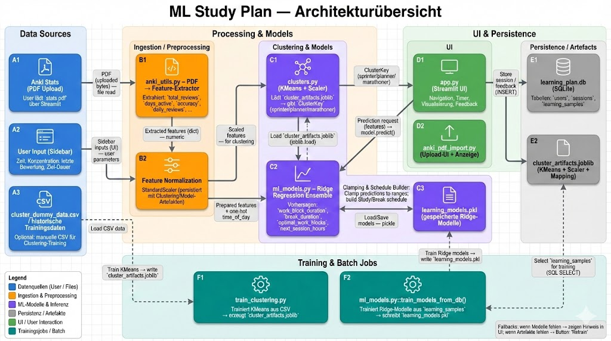

# Apppy
## Make learning great again

A Web-Tool to analyse und predict learning intervals with maximum effectivness, developed for Computer Science AS25. It is programmed with Python and HTML and uses a Ridge-Regression-Model to generate the predictions.

## Project Structure
app.py --> UI und "Main-Engine" der Streamlit-Anwendung: Erstellen, Vorhersagen und Visualisieren

anki_pdf_import.py; anki_utils.py --> Streamlit application für einen PDF-reader aus Anki Decks

clusters.py --> Lädt Clustering "Bubbles" und weist Nutzer einem zu

train_clustering.py --> Skript zum Trainieren und Persistieren eines KMeans-Modells

database.py --> Streamlit UI for database supporting code

ml_models.py --> Ridge-Regression model

Credit: Gemini; 
Note: This is is partly german, as we generated it for internal use, towards the end of programming to not lose sight.

## How to Run the App

Open a terminal in the project directory and execute:

1. `pip install -r requirements.txt`
    (will download: streamlit, pandas, numpy, plotly, scikit-learn, pdfplumber, uvicorn, matplotlib, fastapi, pydantic, requests)
2. `streamlit run app.py`

## Overview

An intelligent study-plan generator that uses **Ridge Regression** and **clustering** to create personalized plans based on focus level, time of day, and individual learning behaviour.

## Features

- **Machine Learning**: Ridge Regression predicts optimal study/break lengths.
- **Personalized recommendations**: Driven by time of day, perceived concentration, last study session and historical data.
- **Interactive visualization**: Dashboards, study interface and statistics.
- **Feedback loop**: User feedback is stored for future retraining.
- **Streamlit web app**: Interface

### How does it work?

**Machine-learning components**

The app uses **two different machine learning components**:

1. **Clustering** – matches user to learning type, based on own choice or anki deck upload. Uses KMeans with two clusters and fallback cluster "structured planner". 

2. **Ridge Regression** – predicts the length of each study block.

    **Input features**
    - Total session duration (30–240 minutes)
    - Time of day (morning/afternoon/evening/night)
    - Concentration level (1–10)
    - Days since the previous session
    - Rating of the previous session

    **Outputs**
    - work block duration
    - break duration
    - optimal number of work blocks
    - break til next full session (hidden in current version)

## Scientific Background

The synthetic data generated for the training of the ML-Model is based on:
- **Pomodoro technique**: 25 min work + 5 min break
- **Chronobiology**: performance varies over the day
- **Spacing effect**: optimal intervals between learning sessions
- **Survey**: done by us, with about 15 entries, to find correlations and trends bewteen the datapoints

## AI Usage
- specific parts that were created with AI are marked as such in their places
- parts that were supported by AI are also marked as such in their places
- Furthermore, ChatGPT was used to debug and simplify the entire program
- ChatGPT was also used to translate and/or reformulate strings and comments